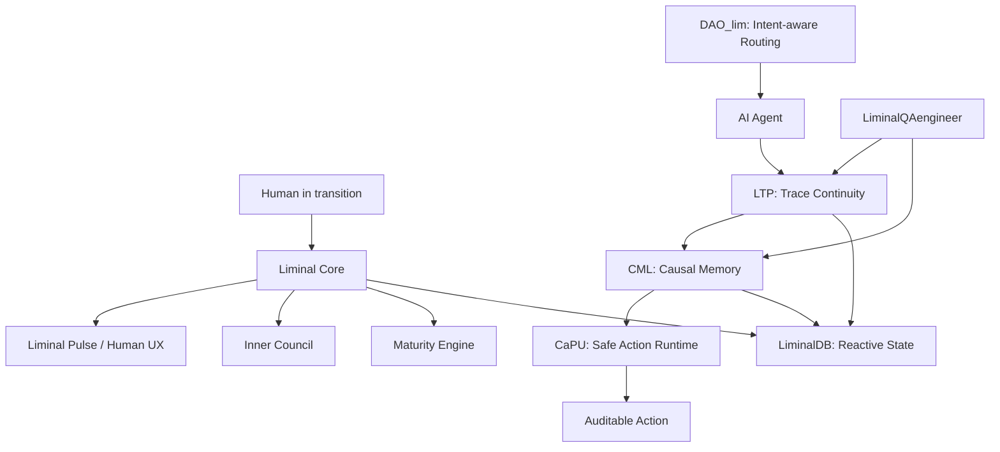

# Liminal Ecosystem

**Liminal** is an ecosystem for continuity in human and AI systems.

It connects two related problems:

1. Humans lose continuity in transitions: stress, uncertainty, emotional overload, unclear intent.
2. AI agents lose continuity across context, memory, permission, traces, and action execution.

Liminal explores both sides: human transition support and auditable AI-agent infrastructure.

---

## Core thesis

Modern systems break continuity.

- Humans need support when moving from anxiety to clarity.
- AI agents need traces, causal memory, and safe execution boundaries.
- Logs show what happened, but often not why it was allowed.
- Agent outputs can look correct while their causal lineage is invalid.

Liminal is the umbrella for tools that make transitions visible, traceable, and safer.

---

## Ecosystem map

| Layer | Repository | Purpose | Status |
|---|---|---|---|
| Human Transition | [`Liminal`](https://github.com/safal207/Liminal) | Inner clarity, reflection, maturity, transition support | Early-access / root hub |
| Agent Continuity | [`LTP`](https://github.com/safal207/L-THREAD-Liminal-Thread-Secure-Protocol-LTP-) | Deterministic replay and trace verification for AI agents | Active technical project |
| Causal Memory | [`CML`](https://github.com/safal207/Causal-Memory-Layer) | Reasons, permissions, responsibility, causal audit | Active technical project |
| Safe Action Runtime | [`CaPU`](https://github.com/safal207/CaPU) | Permission-first runtime: Gate → Incubate → Commit → Execute | Spec-first runtime |
| Reactive Storage | [`LiminalDB`](https://github.com/safal207/LiminalBD) | Biologically inspired reactive state database | Active Rust project |
| AI Routing | [`DAO_lim`](https://github.com/safal207/DAO_lim) | Intent-aware reverse proxy for AI backends, routing, fallback, observability | Active infra project |
| QA Intelligence | [`LiminalQAengineer`](https://github.com/safal207/LiminalQAengineer) | Flake risk, adaptive timeouts, QA observability, merge decisions | Product/prototype direction |
| Intent Clarification | [`DIF`](https://github.com/safal207/DIF) | DeepIntent Funnel: from raw signal to clarified intention | Separate project, not part of Liminal naming |

---

## High-level architecture

---

## Two main narratives

### 1. Human narrative

Liminal helps a person move from inner noise to clarified direction:

- anxiety → clarity
- raw emotion → reflection
- fragmented state → inner continuity
- reaction → mature action

This direction includes Liminal Pulse, Inner Council, emotional memory, maturity signals, and self-dialogue.

### 2. AI infrastructure narrative

Liminal Stack helps AI-agent systems become replayable, causally valid, and auditable:

- trace continuity through LTP
- causal validity through CML
- safe execution through CaPU
- adaptive state through LiminalDB
- routing and fallback through DAO_lim
- QA intelligence through LiminalQAengineer

---

## Commercial entry point

The first practical commercial entry point is:

# Liminal Agent Efficiency Audit

We audit AI-agent workflows and show where they lose:

- context
- money
- safety
- permission chains
- replayability
- audit evidence
- test stability
- routing efficiency

Target users:

- AI startups
- agentic workflow teams
- fintech teams
- QA automation teams
- LLM infrastructure teams
- compliance-heavy companies

---

## Current priority

The priority is not to create more repositories.

The priority is to make the existing ecosystem understandable:

1. clear root README
2. honest status file
3. ecosystem map
4. community roadmap
5. commercial audit page
6. demo story
7. developer quickstart

---

## Short positioning

**Liminal is a continuity layer for human and AI transitions.**

For humans, it helps preserve inner continuity during difficult transitions.

For AI agents, it helps preserve technical continuity through traces, causal memory, and auditable execution.
