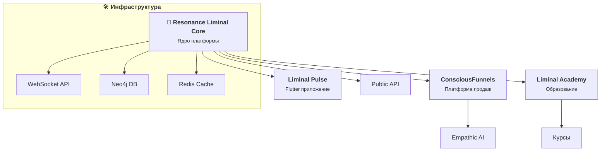

# 🌐 Resonance Liminal: Архитектура экосистемы проектов



## 📦 Основные проекты

### 1. **Resonance Liminal Core**
- **Ядро платформы** (FastAPI, Neo4j, Redis)
- **WebSocket сервер** с real-time коммуникацией
- **API** для интеграции с другими сервисами

### 2. **Liminal Pulse** (Flutter)
- Мобильное приложение для пользователей
- Сбор биометрических данных
- Личный кабинет и аналитика

### 3. **ConsciousFunnels**
- Платформа для создания воронок продаж
- Интеграция с эмпатичным AI
- Аналитика на основе эмоций

### 4. **Liminal Academy**
- Образовательная платформа
- Курсы по сознательному предпринимательству
- Сообщество практиков

## 🔄 Взаимодействие

```
Пользователи → Liminal Pulse → Resonance Core → Neo4j/Redis
                                      ↓
ConsciousFunnels ← API → Другие сервисы
```

## 🚀 Дорожная карта развития

### 2024 Q4:
- [ ] Запуск MVP Liminal Pulse
- [ ] Базовые интеграции с Neo4j
- [ ] Документация API

### 2025 Q1-Q2:
- [ ] Запуск ConsciousFunnels
- [ ] Образовательные курсы
- [ ] Партнерская программа

### 2025 H2:
- [ ] Масштабирование инфраструктуры
- [ ] Enterprise решения
- [ ] Глобальная экспансия
