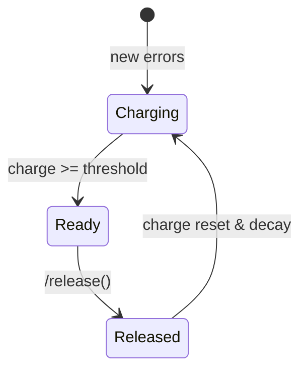

# Resonance-Liminal Log Viewer & Organic Monitoring

This component turns raw logs into a **living dashboard**: cosmic-law compliance, origins of events, endocrine-style emotional memory and more.

---

## 1. Architecture Overview

```
┌────────────┐    logs    ┌───────────────┐      REST       ┌──────────────┐
│  Services  │──────────▶│  LogAnalyzer   │───────────────▶│   Flask API  │
└────────────┘            └───────────────┘                └──────────────┘
                                   │                              ▲
                                   │heartbeats                    │JSON
                                   ▼                              │
                             ┌───────────┐           websocket    │
                             │  Lungs    │────────────────────────┘
                             └───────────┘
                                   │
                                thyroid
                                   ▼
                          Insight Hormones (logs)
```

* **LogAnalyzer** – parses Markdown+JSON log streams.
* **Cosmic Laws scorer** – heuristically maps metrics to nine Hermetic laws.
* **ThyroidSystem** – endocrine layer; accumulates "hurt", emits healing insights.
* **Lungs** – watchdog that pings services, logs heartbeats & feeds thyroid.
* **Flask API** – exposes metrics: `/api/origin_stats`, `/api/cosmic_scores`, `/api/thyroid_status`, etc.
* **Dashboard (Chart.js)** – radar chart for cosmic laws, progress bar for stress.

---

## 2. Endpoints

| Path | Method | Description |
|------|--------|-------------|
| `/api/origin_stats` | GET | Distribution of event origins. |
| `/api/cosmic_scores` | GET | 0-100 scores for 9 cosmic laws. |
| `/api/thyroid_status` | GET | `{charge, threshold, ready}` hormonal stress. |
| `/healthmap` (Lungs) | GET | Latest heartbeat snapshot.

---

## 3. Thyroid System



* **Threshold**: default `100` (configurable).
* **Decay**: `1` per heartbeat (30 s by default).
* **Storage**: `state/thyroid.json` preserves across restarts.
* **Insight Hormone**: logged to `logs/adapter/insights.log`.

---

## 4. Quick Start

```bash
# Install deps
pip install -r requirements.txt

# Run watchdog (pings & endocrine updates)
python backend/ml/tools/log_viewer/lungs.py &

# Start dashboard API
python backend/ml/tools/log_viewer/app.py

# Open in browser
http://localhost:5000
```

---

## 5. Testing

We use **pytest**. Main suites:

* `tests/test_thyroid.py` – unit tests for endocrine logic.
* `tests/test_api_thyroid.py` – Flask endpoint contract.

Run all tests:

```bash
pytest backend/ml/tools/log_viewer/tests -v
```

---

## 6. Extending

1. Change thresholds: `thyroid = ThyroidSystem(threshold=200)` in `endocrine.py`.
2. Hook additional stress sources: call `thyroid.update_from_error_count(...)` in your own workers.
3. Custom insights: modify `thyroid.release()` to generate richer payloads.

---

## 7. Cosmic Laws Reference

| # | Law | Example Metric |
|---|-----|----------------|
| 1 | Rhythm | Balance errors↔insights |
| 2 | Polarity | Healthy vs unhealthy services |
| 3 | Vibration | Repeated error ratio (karma) |
| ... | ... | ... |

See `config/cosmic_laws.yml` for full descriptions.
