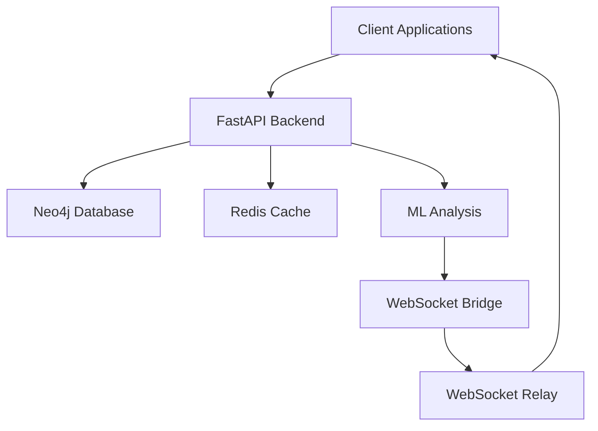

# Liminal API Documentation

## Overview

Liminal is a complex system implementing System Organic Mind Awakening (SOMA) with multiple interconnected components.

## Architecture

### Components

1. **Backend Services**
   - FastAPI REST API
   - Neo4j Database
   - WebSocket Bridge
   - ML Analysis Modules

2. **Frontend Applications**
   - Flutter Mobile App
   - Web Dashboard

3. **Infrastructure**
   - Docker Containers
   - Prometheus Monitoring
   - Grafana Dashboards

### System Diagram



## API Endpoints

### Authentication
- POST `/auth/login`
- POST `/auth/refresh`

### SOMA Core
- GET `/soma/status`
- POST `/soma/analyze`
- GET `/soma/insights`

### Consciousness Cell
- GET `/consciousness/timeline`
- POST `/consciousness/event`
- GET `/consciousness/analysis`

### ML Analytics
- POST `/ml/analyze`
- GET `/ml/predictions`
- GET `/ml/anomalies`

## Security

### Authentication
All API endpoints except health checks require JWT authentication.

### Rate Limiting
API requests are rate-limited based on client IP and authentication token.

### CORS
CORS is enabled for specified origins in development and production environments.

## Development Setup

1. Install dependencies:
```bash
poetry install
```

2. Start development services:
```bash
docker-compose -f docker-compose.development.yml up -d
```

3. Run migrations:
```bash
poetry run python scripts/migrate.py
```

4. Start the development server:
```bash
poetry run uvicorn backend.main:app --reload
```

## Testing

Run tests with:
```bash
poetry run pytest
```

## Monitoring

### Prometheus Metrics
Available at `/metrics`

### Grafana Dashboards
- System Overview: Port 3000
- Performance Metrics
- Error Rates
- ML Model Performance
