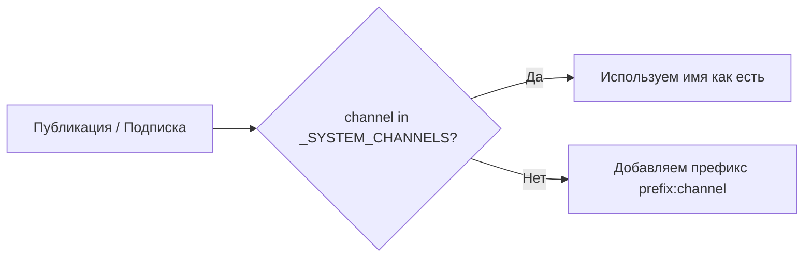

# Redis Pub/Sub Channels

> Обновлено: 29 июля 2025 г.

Документ описывает правила именования каналов Redis, используемых WebSocket-бекендом LIMINAL при горизонтальном масштабировании.

## 1. Классификация каналов

| Категория            | Назначение                                                      | Префикс? |
|----------------------|-----------------------------------------------------------------|----------|
| **Системные**        | Служебная синхронизация между экземплярами сервера:  `broadcast`, `subscribe`, `unsubscribe`, `disconnect`, `personal_message` | **Нет** – имена глобальные, одинаковые для всех экземпляров. |
| **Пользовательские** | Каналы, создаваемые логикой приложения (например `chat_42`, `timeline_updates`). | **Да** – префикс из `RedisClient.prefix` (например `test_cm1:`) добавляется к имени. |

### Почему так?

* Системные каналы должны быть общими, иначе один экземпляр будет публиковать в `test_cm1:broadcast`, а второй слушать `broadcast` — сообщения потеряются.
* Пользовательские каналы изолируются префиксом, чтобы разные окружения (тест/стейдж/прод) не перехватывали сообщения друг друга.

## 2. Алгоритм работы `RedisClient`

Реализовано через внутреннее множество `_SYSTEM_CHANNELS` в `redis_client.py`.

## 3. Матрица «Было / Стало»

| Тип канала | До фикса – SUBSCRIBE | До фикса – PUBLISH | После фикса – SUBSCRIBE | После фикса – PUBLISH |
|------------|---------------------|--------------------|-------------------------|------------------------|
| `broadcast`        | `broadcast`              | `test_cm1:broadcast`      | `broadcast`            | `broadcast`            |
| `subscribe`        | `subscribe`              | `test_cm1:subscribe`      | `subscribe`            | `subscribe`            |
| `unsubscribe`      | `unsubscribe`            | `test_cm1:unsubscribe`    | `unsubscribe`          | `unsubscribe`          |
| `disconnect`       | `disconnect`             | `test_cm1:disconnect`     | `disconnect`           | `disconnect`           |
| `personal_message` | `personal_message`       | `test_cm1:personal_message`| `personal_message`   | `personal_message`     |
| `chat_42` (user)   | `chat_42`                | `test_cm1:chat_42`        | `chat_42`              | `test_cm1:chat_42`     |

## 4. Практические советы

1. **Добавляйте новые системные каналы** в `_SYSTEM_CHANNELS`, если они должны быть глобальными.
2. **Не используйте префиксы вручную** – всегда вызывайте `RedisClient.publish/subscribe`, он применит правило автоматически.
3. В интеграционных тестах включайте `RedisClient.test_mode = True`, чтобы экземпляр считывал собственные публикации.

---

> Вопросы? Создайте issue с меткой `redis-channels`.
