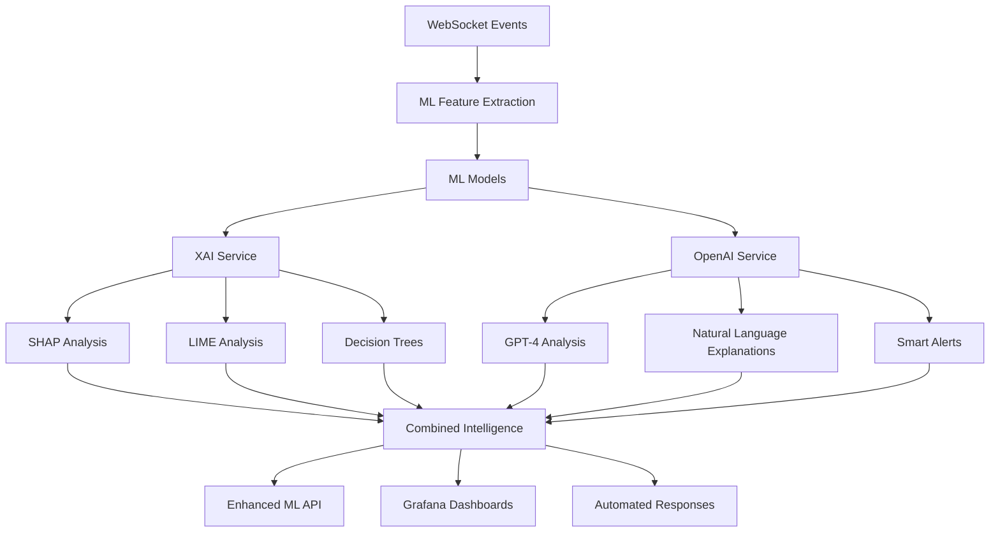

# 🧠 XAI + OpenAI + Claude Multi-LLM Integration for Resonance Liminal

## 🎯 Обзор

Этот документ описывает интеграцию Explainable AI (XAI), OpenAI GPT-4, и Anthropic Claude в Resonance Liminal backend для создания продвинутой Multi-LLM системы анализа и объяснения ML-решений в реальном времени с поддержкой Constitutional AI, этического анализа, и интеллектуального оркестрирования между провайдерами.ллектуального анализа в real-time WebSocket платформах.

### ✨ Ключевые возможности

- **🔍 SHAP/LIME Explanations** - Детальное объяснение каждого ML-предсказания
- **🤖 GPT-4 Natural Language Analysis** - Человекочитаемые объяснения сложных паттернов
- **📊 Real-time Anomaly Explanation** - Мгновенное объяснение обнаруженных аномалий
- **🚨 Smart Alerting** - Интеллектуальные уведомления с контекстом и рекомендациями
- **📈 Performance Analysis** - AI-powered анализ производительности системы
- **🔧 Automated Incident Response** - Автоматические планы реагирования на инциденты

---

## 🏗️ Архитектура



### 🔧 Компоненты

1. **XAI Service** (`xai_service.py`)
   - SHAP (SHapley Additive exPlanations)
   - LIME (Local Interpretable Model-agnostic Explanations)
   - Decision Tree visualization
   - Counterfactual explanations

2. **OpenAI Service** (`openai_service.py`)
   - GPT-4 Turbo integration
   - Natural language analysis
   - Smart alert generation
   - Automated incident response

3. **Enhanced ML API** (`api.py`)
   - XAI endpoints
   - OpenAI intelligence endpoints
   - Combined analysis workflows

4. **Standalone XAI Service** (`xai_main.py`)
   - Микросервис для XAI операций
   - Health checks
   - Performance monitoring

---

## 🚀 Быстрый старт

### 1. Установка зависимостей

```bash
# Основные XAI библиотеки
pip install shap>=0.42.0 lime>=0.2.0

# OpenAI integration
pip install openai>=1.3.0

# ML utilities
pip install scikit-learn>=1.3.0 numpy>=1.24.0 pandas>=2.0.0
pip install joblib>=1.3.0 onnx>=1.14.0 onnxruntime>=1.15.0
```

### 2. Настройка OpenAI API

```bash
# Установите ваш OpenAI API key
export OPENAI_API_KEY="your-openai-api-key-here"

# Опциональные настройки
export OPENAI_MODEL="gpt-4-turbo-preview"
export OPENAI_MAX_TOKENS="2000"
export OPENAI_TEMPERATURE="0.3"
```

### 3. Запуск с Docker Compose

```bash
# Запуск полной ML-инфраструктуры с XAI + OpenAI
docker-compose -f docker-compose.ml-production.yml up -d

# Проверка статуса
curl http://localhost:8000/ml/intelligence/status
```

### 4. Запуск отдельного XAI сервиса

```bash
# Standalone XAI service
cd backend/ml
python xai_main.py

# Или через Docker
docker build -f Dockerfile.xai -t resonance-xai .
docker run -p 8003:8000 -e OPENAI_API_KEY=$OPENAI_API_KEY resonance-xai
```

---

## 📖 API Documentation

### 🔍 XAI Endpoints

#### Объяснение ML-предсказания
```http
POST /ml/explain/prediction
Content-Type: application/json

{
  "model_name": "anomaly_detection",
  "features": {
    "messages_per_minute": 25.0,
    "error_rate": 0.15,
    "connection_duration": 120,
    "burstiness_score": 0.8,
    "ip_entropy": 3.5
  },
  "prediction": "anomaly",
  "confidence": 0.85
}
```

**Response:**
```json
{
  "model_name": "anomaly_detection",
  "prediction": "anomaly",
  "confidence": 0.85,
  "feature_importance": {
    "burstiness_score": 0.45,
    "ip_entropy": 0.32,
    "error_rate": 0.18,
    "messages_per_minute": 0.05
  },
  "technical_explanation": "SHAP Analysis: Наиболее важные факторы...",
  "natural_explanation": "Эта аномалия обнаружена из-за необычно высокого коэффициента всплесков активности (0.8) и подозрительной энтропии IP адресов (3.5). Рекомендуется проверить источник трафика и рассмотреть временную блокировку.",
  "shap_values": [0.45, 0.32, 0.18, 0.05],
  "counterfactual": {
    "suggestions": ["Снизить частоту сообщений до 15/мин", "Улучшить качество соединения"]
  }
}
```

#### Объяснение аномалии
```http
POST /ml/explain/anomaly
Content-Type: application/json

{
  "user_id": "user_12345"
}
```

### 🤖 OpenAI Intelligence Endpoints

#### Анализ логов
```http
POST /ml/analyze/logs
Content-Type: application/json

{
  "log_entries": [
    "ERROR: WebSocket connection failed for user user_123",
    "WARNING: High latency detected: 1500ms",
    "ERROR: Rate limit exceeded for IP 192.168.1.100"
  ],
  "time_range": "last_hour",
  "error_patterns": ["ERROR", "WARNING", "FAILED"]
}
```

#### Генерация Smart Alert
```http
POST /ml/alerts/smart
Content-Type: application/json

{
  "alert_data": {
    "message": "High error rate detected",
    "metric": "error_rate",
    "value": 0.25,
    "threshold": 0.1
  },
  "context": {
    "service": "websocket",
    "environment": "production",
    "affected_users": 150
  },
  "recipient_role": "devops"
}
```

### 📊 Health Check Endpoints

```http
GET /ml/health/xai          # XAI service health
GET /ml/health/openai       # OpenAI service health
GET /ml/intelligence/status # Overall intelligence status
```

---

## 🧪 Load Testing с Artillery.io

### Запуск нагрузочного тестирования

```bash
# Установка Artillery
npm install -g artillery

# Запуск XAI + OpenAI load test
cd tests/load-testing
artillery run artillery-xai-test.yml

# Генерация отчета
artillery run artillery-xai-test.yml --output results.json
artillery report results.json
```

### 📈 Целевые метрики производительности

| Операция | Целевая латентность | SLA |
|----------|-------------------|-----|
| ML API | < 100ms | 99.5% |
| XAI объяснения | < 2000ms | 95% |
| OpenAI анализ | < 5000ms | 90% |
| WebSocket + ML | < 500ms | 99% |
| Smart alerts | < 3000ms | 95% |

### 🎯 Сценарии тестирования

1. **ML Status Check** (10%) - Проверка статуса ML системы
2. **XAI Prediction Explanation** (25%) - Объяснение предсказаний
3. **OpenAI Log Analysis** (15%) - Анализ логов через GPT-4
4. **Smart Alert Generation** (10%) - Генерация умных уведомлений
5. **Combined WebSocket + ML Flow** (10%) - End-to-end тестирование

---

## 🔧 Конфигурация

### Environment Variables

```bash
# XAI Configuration
XAI_CACHE_SIZE=1000
XAI_ENABLE_SHAP=true
XAI_ENABLE_LIME=true

# OpenAI Configuration
OPENAI_API_KEY=your-api-key
OPENAI_MODEL=gpt-4-turbo-preview
OPENAI_MAX_TOKENS=2000
OPENAI_TEMPERATURE=0.3

# ML Service URLs
ML_SERVICE_URL=http://kenning-ml:5000
KENNING_SERVICE_URL=http://kenning-ml:5000

# Redis Configuration
REDIS_HOST=redis
REDIS_PORT=6379
```

### Docker Compose Services

```yaml
services:
  # Main backend with XAI integration
  backend:
    environment:
      - OPENAI_API_KEY=${OPENAI_API_KEY}
      - XAI_ENABLE_SHAP=true
      - XAI_ENABLE_LIME=true

  # Standalone XAI Intelligence Service
  xai-intelligence:
    build:
      context: ./backend/ml
      dockerfile: Dockerfile.xai
    ports:
      - "8003:8000"
    environment:
      - OPENAI_API_KEY=${OPENAI_API_KEY}
      - XAI_CACHE_SIZE=1000
```

---

## 💡 Примеры использования

### 1. Объяснение аномалии в реальном времени

```python
# В вашем коде обработки WebSocket событий
from ml.xai_service import xai_service
from ml.openai_service import openai_service

async def handle_anomaly_detected(user_id: str, anomaly_data: dict):
    # Получаем XAI объяснение
    explanation = await xai_service.explain_prediction(
        model_name="anomaly_detection",
        features=anomaly_data["features"],
        prediction=anomaly_data["prediction"],
        confidence=anomaly_data["confidence"]
    )
    
    # Получаем OpenAI анализ
    analysis = await openai_service.analyze_anomaly(
        anomaly_data=anomaly_data,
        ml_explanation=explanation.feature_importance
    )
    
    # Генерируем smart alert
    smart_alert = await openai_service.generate_smart_alert(
        alert_data={
            "user_id": user_id,
            "anomaly_type": anomaly_data["type"],
            "severity": analysis.severity
        },
        context={"explanation": explanation.explanation_text},
        recipient_role="devops"
    )
    
    # Отправляем уведомление
    await send_alert_to_monitoring(smart_alert)
```

### 2. Анализ производительности с AI insights

```python
async def analyze_system_performance():
    # Получаем метрики системы
    metrics = await get_system_metrics()
    
    # AI анализ производительности
    analysis = await openai_service.analyze_performance_patterns(
        metrics=metrics["current"],
        time_series_data=metrics["history"],
        baseline=metrics["baseline"]
    )
    
    # Создаем actionable recommendations
    if analysis.severity in ["high", "critical"]:
        await trigger_auto_scaling(analysis.recommendations)
        await notify_devops_team(analysis.summary)
```

### 3. Intelligent Log Analysis

```python
async def analyze_error_logs(log_entries: List[str]):
    # OpenAI анализ логов
    analysis = await openai_service.analyze_logs(
        log_entries=log_entries,
        time_range="last_hour",
        error_patterns=["ERROR", "CRITICAL", "FAILED"]
    )
    
    # Автоматические действия на основе анализа
    if analysis.severity == "critical":
        await create_incident_ticket(analysis)
        await page_on_call_engineer(analysis.summary)
    
    return analysis
```

---

## 🔍 Мониторинг и Observability

### Prometheus Metrics

```python
# XAI метрики
xai_explanations_total = Counter('xai_explanations_total', 'Total XAI explanations generated')
xai_explanation_duration = Histogram('xai_explanation_duration_seconds', 'XAI explanation generation time')

# OpenAI метрики
openai_requests_total = Counter('openai_requests_total', 'Total OpenAI API requests')
openai_response_duration = Histogram('openai_response_duration_seconds', 'OpenAI API response time')
openai_token_usage = Counter('openai_tokens_used_total', 'Total OpenAI tokens consumed')
```

### Grafana Dashboards

1. **XAI Performance Dashboard**
   - Explanation generation latency
   - Feature importance trends
   - Cache hit rates
   - Model accuracy over time

2. **OpenAI Intelligence Dashboard**
   - API response times
   - Token usage and costs
   - Analysis quality metrics
   - Smart alert effectiveness

3. **Combined AI/ML Dashboard**
   - End-to-end ML pipeline performance
   - Anomaly detection accuracy
   - Automated response success rates

---

## 🚨 Troubleshooting

### Частые проблемы

#### 1. OpenAI API Rate Limits
```bash
# Проверка лимитов
curl -H "Authorization: Bearer $OPENAI_API_KEY" \
     https://api.openai.com/v1/usage

# Решение: Implement exponential backoff
```

#### 2. XAI Memory Issues
```python
# Очистка кэша XAI
await xai_service.clear_cache()

# Ограничение размера кэша
XAI_CACHE_SIZE=500
```

#### 3. Медленные SHAP вычисления
```python
# Оптимизация SHAP
explainer = shap.TreeExplainer(model, max_evals=100)
```

### Логи и Debugging

```bash
# XAI Service логи
docker logs resonance-xai-intelligence

# OpenAI API debugging
export OPENAI_LOG_LEVEL=debug

# ML Pipeline debugging
curl http://localhost:8000/ml/intelligence/status
{{ ... }}
curl http://localhost:8000/ml/claude/health
{{ ... }}
curl http://localhost:8000/ml/multi-llm/health
{{ ... }}
curl http://localhost:8000/ml/ai-status
{{ ... }}
### 🌟 Долгосрочная vision (3-6 месяцев)

- [ ] **Causal AI Integration** - Причинно-следственный анализ
- [ ] **Federated XAI** - Distributed explanations across microservices
- [ ] **Real-time Model Retraining** - Автоматическое переобучение на основе feedback

---

## 🎮 Бонус: "Умный помощник для геймеров"

### 🎯 Сценарий: "Лаги в игре - кто виноват?"
### 📖 Документация

- [SHAP Documentation](https://shap.readthedocs.io/)
- [LIME Documentation](https://lime-ml.readthedocs.io/)
- [OpenAI API Reference](https://platform.openai.com/docs/api-reference)
- [Artillery.io Load Testing](https://www.artillery.io/docs)

### 🎓 Обучающие материалы

- [Explainable AI Best Practices](https://christophm.github.io/interpretable-ml-book/)
- [OpenAI GPT-4 Prompt Engineering](https://platform.openai.com/docs/guides/prompt-engineering)
- [ML Interpretability in Production](https://www.oreilly.com/library/view/interpretable-machine-learning/9781492033158/)

### 🤝 Community и Support

- **GitHub Issues** - Для багов и feature requests
- **Discord Channel** - Real-time поддержка и обсуждения
- **ML/AI Slack** - Обмен опытом с community

---

## ✅ Заключение

Интеграция **XAI + OpenAI** в Resonance Liminal создает новый стандарт для intelligent WebSocket платформ:

🎯 **Полная прозрачность ML-решений** через SHAP/LIME
🤖 **Human-friendly объяснения** через GPT-4
📊 **Proactive monitoring** с AI-powered insights
🚨 **Smart alerting** с контекстом и рекомендациями
⚡ **Real-time intelligence** для критических систем

Эта интеграция превращает Resonance Liminal из обычной WebSocket платформы в **AI-first intelligent system**, способную к самоанализу, объяснению своих решений и проактивному реагированию на проблемы.

**Ready for the future of intelligent real-time systems! 🚀**
