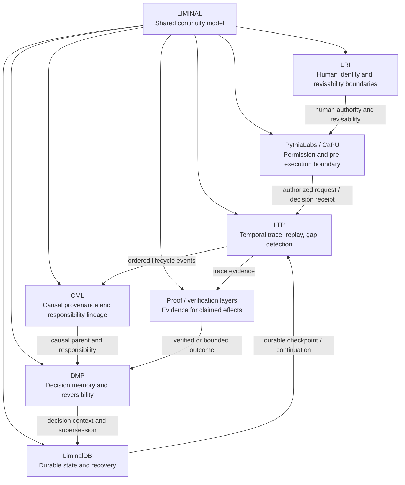

# Liminal Continuity Web v0.1

**Status:** Public architecture note  
**Project:** LIMINAL  
**Author:** Alexey Safalov / safal207  
**Date:** 2026-08-27

## Summary

Liminal is the shared continuity model that connects intent, requests, decisions, actions, outcomes, evidence, memory, and recovery across human and AI systems.

The central invariant is:

```text
Request / intent
    -> observable pending or suspended state
    -> one canonical terminal outcome
    -> evidence and memory for what happens next
```

In compact form:

```text
No orphan request.
No orphan response.
No silent gap.
```

This is a continuity invariant. It is not, by itself, a claim that an external side effect happened exactly once, that the result is correct, or that the action was authorized.

## 1. Why a continuity web

A single event can look valid while the surrounding history is broken.

Examples:

- a request exists, but no result or durable pending state survives a restart;
- a response exists, but no known request explains it;
- two conflicting terminal outcomes claim to complete the same logical request;
- a retry is recorded as a new action and hides a duplicate side effect;
- a child request appears without a known parent or causal event;
- a final answer is present, but the path, evidence, and responsibility chain are missing.

Liminal treats these as breaks in one connected continuity problem rather than isolated logging defects.

## 2. Core lifecycle

```text
CREATED
   -> ACCEPTED
   -> PENDING
   -> COMPLETED | FAILED | REJECTED | CANCELLED | TIMED_OUT
```

A workflow may also cross a durable suspension boundary:

```text
PENDING -> DEFERRED -> RESUMED -> terminal outcome
```

`DEFERRED` is not a silent gap. It remains continuous only when the system preserves a continuation reference and an observable state.

## 3. Continuity invariants

### 3.1 Every outcome has a known origin

Every response or terminal outcome must reference an existing logical request, action, or decision identity.

```text
outcome.request_id -> existing request.id
```

A response without a known origin is an orphan response.

### 3.2 Every request remains observable

A request must be either:

- actively pending;
- durably deferred or suspended;
- or connected to a recorded terminal outcome.

A request that disappears without any of these states creates a silent gap.

### 3.3 One canonical terminal outcome

One logical request has one canonical terminal state.

Duplicate transport delivery may occur, but it must be recognized as replay of the same outcome rather than a second logical completion.

Two materially different terminal outcomes for the same request create a conflict.

### 3.4 Time and causality do not reverse

An outcome cannot precede the request it claims to complete.

A child request or derived action must reference a known parent request, decision, response, or lifecycle event.

### 3.5 Retries preserve logical identity

A retry should distinguish the logical request from its individual attempts:

```text
request_id
attempt_id
retry_of
trace_id
```

This allows several attempts while preserving one logical history.

## 4. Continuity verdicts

```text
CONTINUOUS
PENDING
DEFERRED
BROKEN_ORPHAN_REQUEST
BROKEN_ORPHAN_RESPONSE
BROKEN_MISSING_OUTCOME
BROKEN_CONFLICTING_OUTCOMES
BROKEN_TIME_REVERSAL
BROKEN_PARENT_GAP
REPLAY_DETECTED
```

A real implementation may use different names. The important requirement is to distinguish valid incompleteness (`PENDING` or durable `DEFERRED`) from a broken or missing history.

## 5. The continuity web



## 6. Repository roles

| Layer | Responsibility | What it does not prove alone |
|---|---|---|
| **Liminal** | Shared lifecycle, vocabulary, and continuity invariants. | Runtime enforcement or real-world execution. |
| **LTP** | Preserves and evaluates temporal execution paths; supports replay and gap detection. | Truth of an external effect or universal exactly-once execution. |
| **CML** | Preserves causal provenance, permission lineage, and responsibility links. | That the action was successfully executed. |
| **PythiaLabs / CaPU** | Evaluates whether a proposed action may proceed, be blocked, or require escalation. | That an allowed action later completed correctly. |
| **DMP** | Preserves decisions, reversibility assumptions, consequences, and supersession. | Full runtime trace integrity. |
| **LiminalDB** | Provides durable state, checkpoints, and recovery substrate. | Semantic correctness of stored records. |
| **Proof / verification layers** | Check evidence supporting a claimed result or side effect. | The complete causal and temporal history by themselves. |
| **LRI** | Preserves human authority, revisability, and relational identity boundaries. | Technical replay or storage durability. |

## 7. Minimal regression matrix

| Scenario | Expected continuity result |
|---|---|
| Request followed by successful response | `CONTINUOUS` |
| Request followed by explicit failure | `CONTINUOUS` |
| Request is still within its valid execution window | `PENDING` |
| Workflow is durably suspended with a continuation reference | `DEFERRED` |
| Request disappears after restart | `BROKEN_MISSING_OUTCOME` |
| Response references no known request | `BROKEN_ORPHAN_RESPONSE` |
| Same logical response is delivered twice | `REPLAY_DETECTED`; no second canonical completion |
| Two different terminal results claim the same request | `BROKEN_CONFLICTING_OUTCOMES` |
| Outcome timestamp precedes request timestamp | `BROKEN_TIME_REVERSAL` |
| Child request has no known parent or causal event | `BROKEN_PARENT_GAP` |
| Retry preserves request identity and creates a new attempt identity | `CONTINUOUS` |

## 8. Claim boundaries

The continuity web does not automatically prove:

- that an action was authorized;
- that a response is correct or truthful;
- that a payment, deployment, message, or other external effect really occurred;
- that a side effect occurred exactly once;
- that no event was omitted before observation began;
- production security, compliance, or certification.

Its narrower purpose is:

> Preserve and evaluate whether the observable history remains connected across intent, execution, outcome, evidence, memory, and recovery.

## 9. Relationship to existing documents

- [Liminal Agent Continuity Model v0.1](./LIMINAL_AGENT_CONTINUITY_MODEL_V0_1.md) defines the broader lifecycle for memory, evidence, decisions, actions, and recovery.
- [LTP Ecosystem Spider Map](https://github.com/safal207/L-THREAD-Liminal-Thread-Secure-Protocol-LTP-/blob/main/docs/ECOSYSTEM_SPIDER_MAP.md) shows how the technical repositories form one reviewer-facing evidence architecture.
- [LTP repository](https://github.com/safal207/L-THREAD-Liminal-Thread-Secure-Protocol-LTP-) is the active trace, replay, and path-inspection layer.

## 10. Next implementation steps

For a minimal v0.2:

1. define a machine-readable request/outcome envelope;
2. add orphan, missing-outcome, conflicting-outcome, replay, and retry fixtures;
3. preserve explicit non-claims around external effects and exactly-once behavior;
4. map LTP trace events to the shared continuity verdicts;
5. demonstrate recovery across a process restart without losing the logical request identity.
