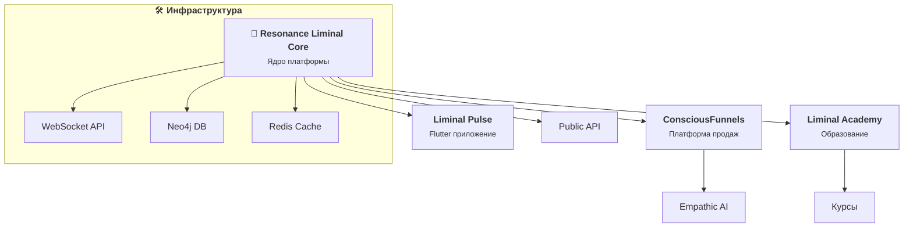

# 🌌 LIMINAL — основной обзор (восстановленная версия)

**LIMINAL** — гибридная AI‑платформа для осознанных переходов, внутренней зрелости и развития автономии.

## ✨ Что делает LIMINAL
- Отслеживает временные и биометрические паттерны
- Помогает переходить от тревоги к ясности
- Развивает внутреннюю мудрость через «Внутренний Совет»
- Поддерживает диалог с собой и автономию

## 🧠 Архитектура экосистемы (обзор)

Ключевые блоки:
- Core (FastAPI, Neo4j, Redis), realtime WebSocket
- ML‑pipeline (Python), Meta‑Liminal и Maturity Engine
- Клиент: Flutter/Elm

## 📚 Быстрая навигация по документации
- Архитектура экосистемы: `../research/ECOSYSTEM_ARCHITECTURE.md`
- Подсистема SOMA (полная дока): `docs/SOMA_Documentation.md`
- Быстрый старт SOMA: `../research/README_SOMA.md`
- Бэклог (общий): `BACKLOG.md`
- Бэклог 2025: `PROJECT_BACKLOG_2025.md`
- Планы спринтов: `SPRINT_3_PLAN.md`, `SPRINT_4_PLAN.md`
- Термины: `docs/GLOSSARY.md`

## 🔍 Статус
Проект в стадии early‑access. Сбор интереса и обратной связи: https://safal207.github.io/Liminal

## 📫 Связь
`safal0645@gmail.com`
